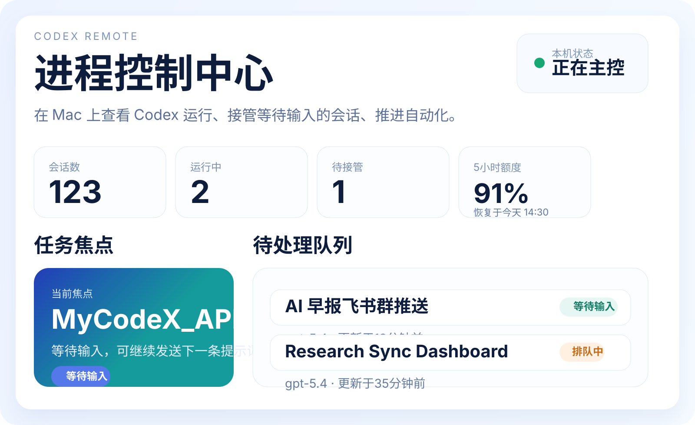
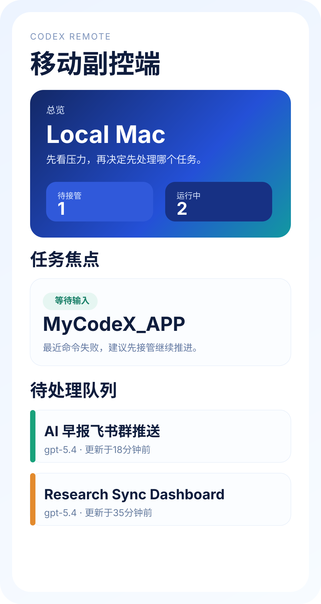
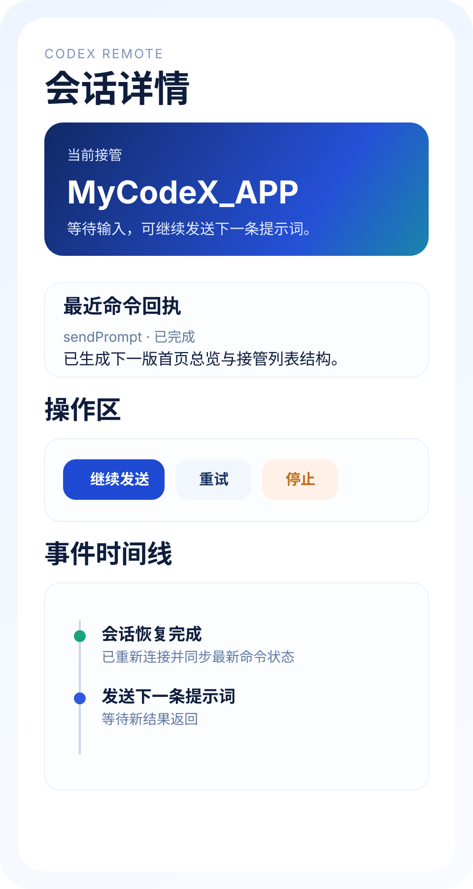

# Codex Remote

Codex Remote is a local-first companion for Codex:

- `Mac = 主控台`
- `iPhone / iPad = 副控端`
- `本地优先，局域网可用`

它的目标很直接：

- 在 Mac 上查看、接管和推进本机 Codex 会话
- 在 iPhone / iPad 上随时查看总览、恢复连接、继续会话

## 产品预览

### Mac 主控台



### iPhone / iPad 总览



### iPhone / iPad 会话详情



## 核心能力

### Mac 主控台

- 读取本地 Codex 会话、运行状态、自动化、模板、额度和最近命令
- Web 控制台提供总览、任务焦点、待处理队列、接管列表和会话工作台
- 本地启动器可自动拉起服务并打开控制台

### iPhone / iPad 副控端

- 原生 SwiftUI App
- 首次 onboarding、帮助页、演示模式
- 已信任设备恢复、附近 Mac 发现、二维码 / 地址 / 配对码接入
- 首页总览、任务焦点、待处理队列、会话列表、会话详情

## 快速开始

### 1. 启动 Mac 主控台

```bash
npm run server:start
```

或直接使用打包后的本地启动器：

- `dist/Codex Remote.app`
- `dist/Launch Codex Remote.command`
- `dist/Stop Codex Remote.command`

### 2. 打开 Web 控制台

默认本地入口：

- [http://127.0.0.1:8793/app](http://127.0.0.1:8793/app)

说明：

- 启动器会优先复用已经可用的本地端口
- 默认首选 `8793`
- 如果该端口不可用，会自动切换到备用端口并打开正确地址

### 3. 打开 iPhone / iPad 工程

```bash
npm run ios:open
```

或直接构建：

```bash
npm run ios:build
```

## 开发命令

运行 Node 测试：

```bash
npm test
```

运行 Swift 测试：

```bash
swift test
```

运行全部测试：

```bash
npm run test:all
```

打包本地桌面使用包：

```bash
npm run app:package
```

## 项目结构

服务端与本地控制面：

- `src/server`
- `src/agent`

Web 主控台：

- `public/app`
- `src/client`

iPhone / iPad App：

- `Apps/ControlPlaneMobile`
- `Sources/ControlPlaneMobileCore`

测试：

- Node 测试：`test`
- Swift 测试：`Tests`

归档 / 非主线目录：

- 历史设计与计划：`docs/superpowers`
- 临时实验区：`Try2`

## 文档

- 使用帮助：[`docs/help/codex-remote-user-guide.md`](docs/help/codex-remote-user-guide.md)
- Mac 安装与启动：[`docs/help/codex-remote-mac-setup-guide.md`](docs/help/codex-remote-mac-setup-guide.md)
- App Store 文案：[`docs/app-store/app-store-copy.md`](docs/app-store/app-store-copy.md)
- 截图清单：[`docs/app-store/screenshot-shot-list.md`](docs/app-store/screenshot-shot-list.md)
- 提交清单：[`docs/app-store/submission-checklist.md`](docs/app-store/submission-checklist.md)

## 面向产品主线的接口

- `GET /app`
- `GET /health`
- `GET /pairing`
- `GET /pairing/token`
- `GET /pairing/bootstrap`
- `GET /mobile/bootstrap`
- `GET /mobile/dashboard`
- `GET /mobile/sessions/:sessionId`
- `GET /commands`
- `POST /commands`
- `POST /pairing/rotate`

开发 / 诊断接口：

- `GET /snapshot`
- `GET /events?runId=<thread-id>&limit=20`
- `GET /sync/status`
- `POST /sync/run`

## 当前边界

- 当前项目优先保证 `Mac 主控台` 和 `iPhone / iPad 副控端` 的本地自用体验
- 连接层仍以本地 / 局域网 / 私网可达为主
- 云端中继、公开托管和更多实验能力暂时不作为当前主线
- `dist` 是生成产物目录，不作为源码维护入口

## 开源说明

- 许可证：[`LICENSE`](LICENSE)
- 贡献说明：[`CONTRIBUTING.md`](CONTRIBUTING.md)
- 隐私说明：[`PRIVACY.md`](PRIVACY.md)
