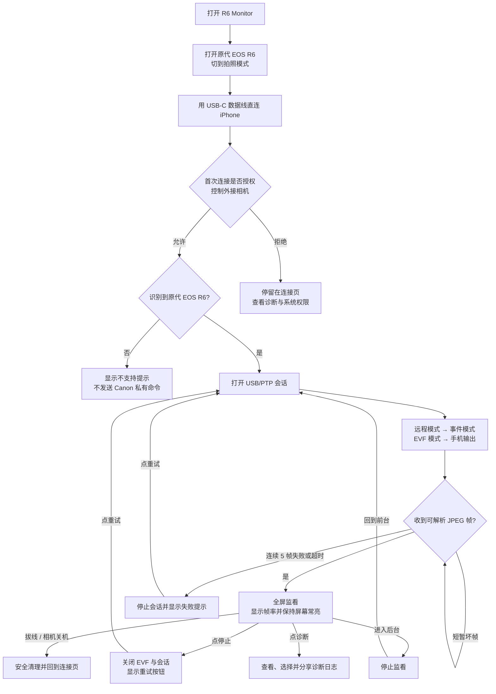
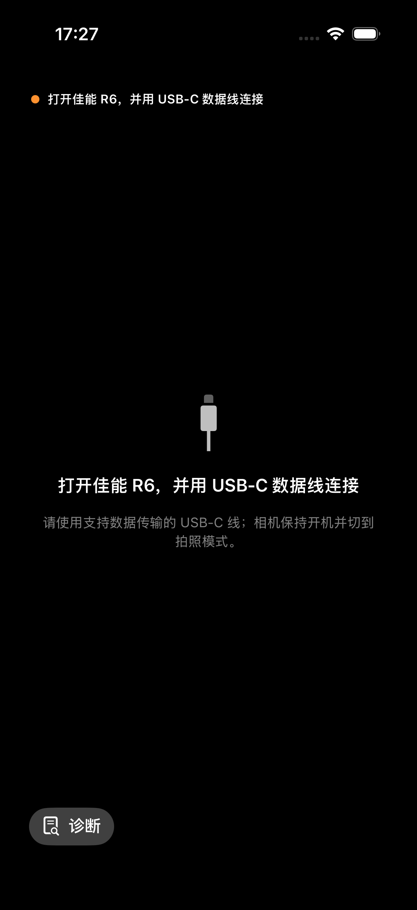
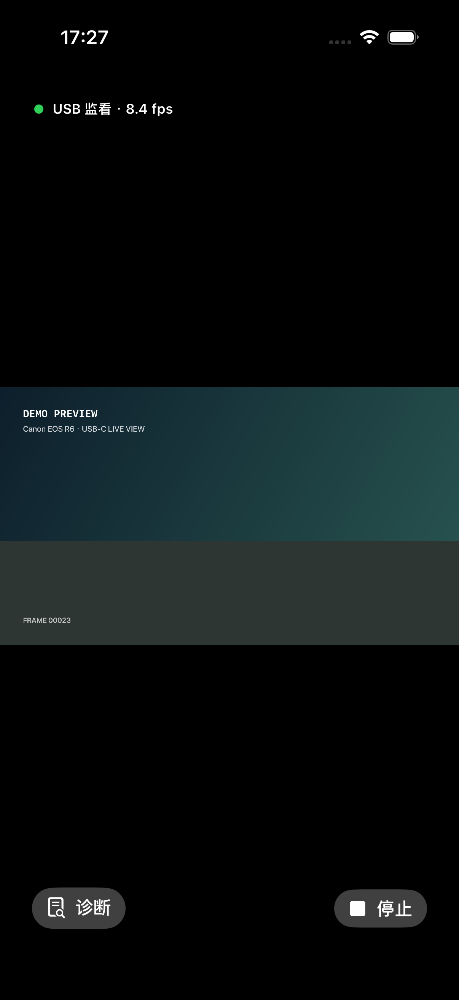
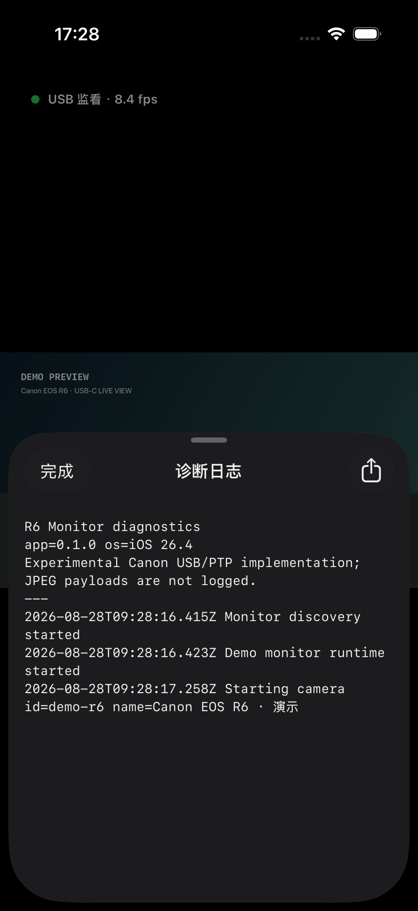

# R6 Monitor 页面与使用流程

更新日期：2026-08-28

## 使用流程图

## 页面与状态

### 1. 等待连接

- 顶部状态和中央说明给出同一条关键动作，首次使用无需找设置入口。
- 底部始终保留“诊断”，即使连接失败也能远程收集信息。
- 当前模拟器不能访问 USB 相机，所以这张图只验证页面布局。

### 2. 正在监看

- 画面按原比例完整显示，黑边不会裁掉相机取景内容。
- 顶部显示 USB 状态和即时帧率；底部提供诊断与停止。
- 图中的 `DEMO PREVIEW` 是 Debug 演示帧，用于检查页面，不是 R6 真机画面。

### 3. 诊断日志

- 日志先展示给用户，可长按选择文本，再通过右上角分享。
- 日志包含状态、操作码、响应码和字节数，不包含 JPEG 画面。

## 本轮代码审查结论

整体结构清楚：相机发现、PTP 传输、Canon 会话、EVF 解析和 SwiftUI 状态相互分离，适合后续根据朋友返回的日志单独调整协议层。

本轮已修复：

1. 为打开会话、发送 PTP 命令和关闭会话加入有界超时，避免拔线或相机关机后永久等待回调。
2. 连续坏帧达到 5 帧才结束监看；偶发坏帧会被跳过。
3. 手动停止后回到前台不再自动重连；停止页可以点“重试”恢复。
4. 未连接时点重试不会重复启动相机发现或再次申请权限。
5. 监看期间接入其他不支持的设备，不会覆盖当前串流状态。
6. 相机错误文案不再把取帧命令误称为“初始化命令”。
7. 诊断入口改为先查看日志、再分享，状态区域补充辅助功能标签。
8. 增加仅 Debug 构建可用的演示串流，方便没有 R6 时检查完整页面。

## 仍需真机确认

- 原代 EOS R6 不同固件是否接受当前 Canon 私有 PTP 初始化顺序。
- iPhone 直连时系统是否稳定把 R6 暴露给 ImageCaptureCore。
- 实际帧率、延迟、发热、耗电以及横屏长时间稳定性。
- 拔线、相机关机、锁屏和来电中断后的真实恢复表现。
- VoiceOver 阅读顺序、动态字体极大字号和物理横屏需在真机继续验证；截图本身不能证明完整无障碍合规。

## 推荐的朋友测试顺序

1. 先只验证 App 能否识别相机，并导出一份日志。
2. 再验证是否出现第一帧，失败时不要连续盲目重试。
3. 第一帧成功后连续监看 10 分钟，记录帧率、温度和耗电。
4. 最后分别测试手动停止、拔线、相机关机、锁屏再返回。

详细记录项见 [hardware-test-checklist.md](hardware-test-checklist.md)。
